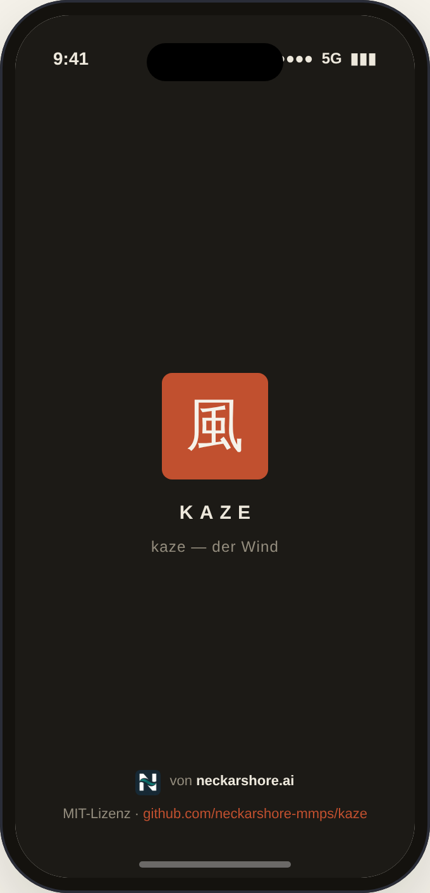
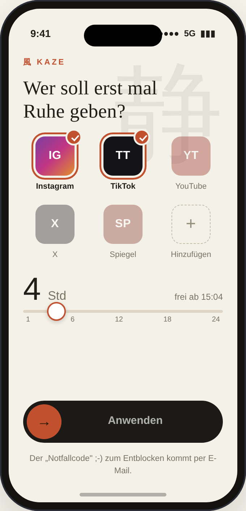
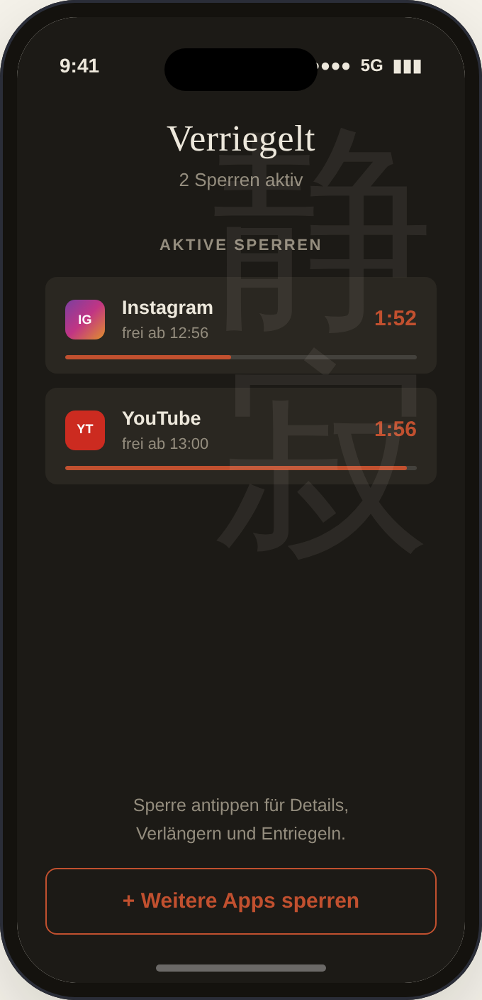
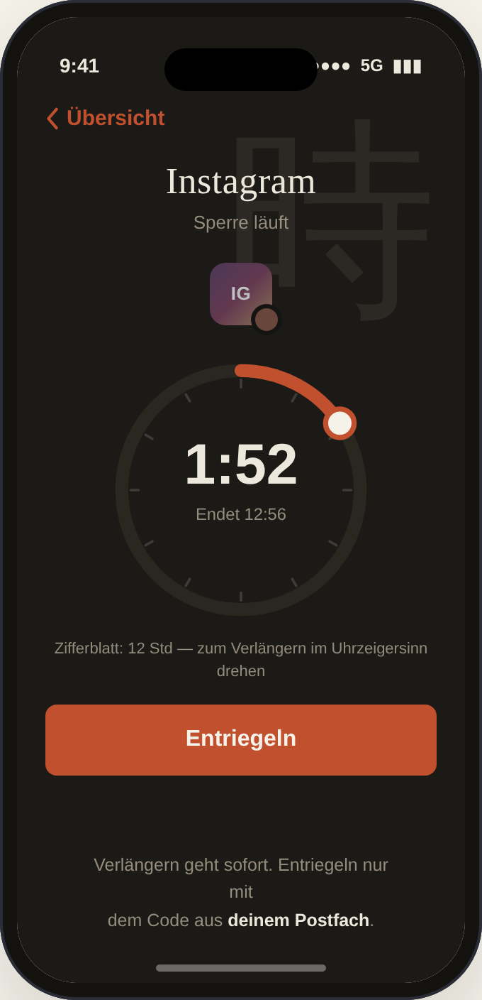
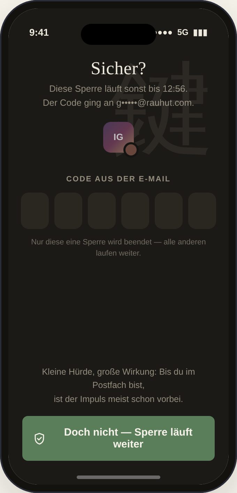
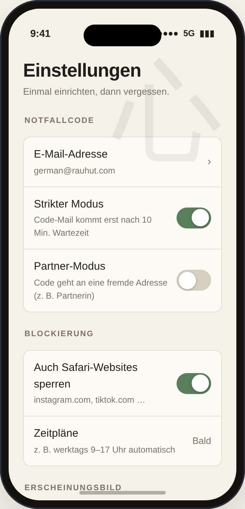
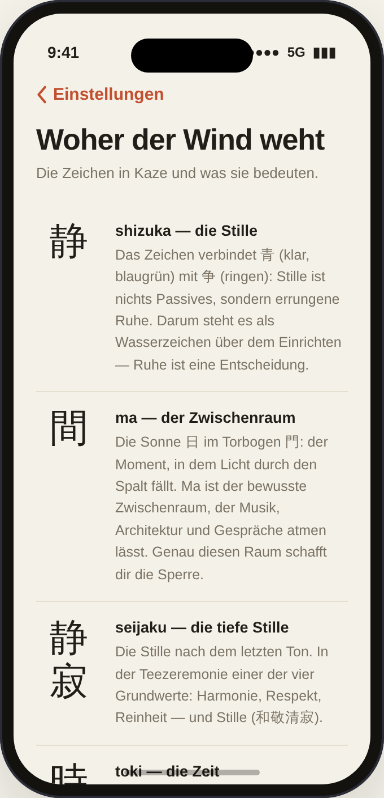
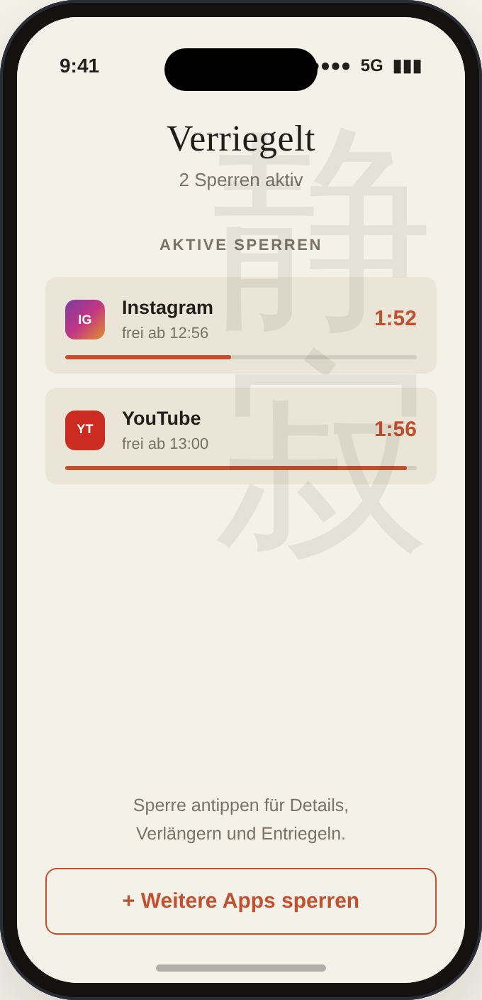

# Kaze 風

> Der App-Blocker, der dich rausschickt, den Wind suchen.

Kaze ist eine bewusst einfache iPhone-App: definierte Apps für eine definierte Zahl Stunden sperren. Der „Notfallcode" ;-) zum vorzeitigen Entblocken kommt per E-Mail — er existiert nirgendwo auf dem Gerät. Die Hürde ist klein genug für echte Notfälle und groß genug, um den Reflex-Griff zum Handy zu brechen.

**Kostenlos. Open Source (MIT). Kein Abo, kein Kauf, kein Login, keine Statistiken.**

Ein Projekt von [neckarshore.ai](https://neckarshore.ai).

**▶ Mockup ausprobieren:** [`mockup/kaze-mockup.html`](mockup/kaze-mockup.html) — der komplette Flow als klickbarer Prototyp. Eine Datei, keine Installation. Datei herunterladen und im Browser öffnen (GitHub zeigt HTML als Quelltext, nicht gerendert).

---

## Die App in Bildern

| Splash | Einrichten | Verriegelt | Sperre |
|:---:|:---:|:---:|:---:|
|  |  |  |  |

| Entsperren | Einstellungen | Glossar | Heller Modus |
|:---:|:---:|:---:|:---:|
|  |  |  |  |

## Warum Kaze?

Es gibt App-Blocker. Die meisten verlangen 15 Euro im Monatsabo und verkaufen dazu Statistiken, Streaks und „Focus Scores". Kaze macht das Gegenteil:

- **Reibung statt Unmöglichkeit.** Es geht nicht darum, Entsperren unmöglich zu machen — echte Notfälle gehen immer. Es geht um die sechzig Sekunden Umweg übers E-Mail-Postfach, die der Impuls „nur kurz Instagram" selten überlebt.
- **Asymmetrie mit Absicht.** Verlängern geht jederzeit sofort, per Drehen am Zifferblatt. Verkürzen geht nur mit dem Notfallcode aus der Mail. Mehr Sperre braucht keine Hürde — nur weniger.
- **Nachdenkpausen statt Verbote.** Vor dem Entriegeln und vor dem Einschalten von Benachrichtigungen fragt Kaze 15 Sekunden lang: „Willst du noch einmal drüber nachdenken?" Die größte Fläche auf dem Screen gehört immer der Entscheidung, dranzubleiben.

## Wie Kaze funktioniert

1. **Sperren:** Apps im Raster antippen, Stunden per Slider wählen (1–24), Riegel zuschieben — die Wisch-Geste „Anwenden" ist die Bestätigung, kein Extra-Dialog.
2. **Laufen lassen:** Jede Sperre hat ihre eigene Uhr; beliebig viele laufen parallel. Die Übersicht „Verriegelt" zeigt alle aktiven Sperren mit Restzeit (h:mm — keine Sekunden, das wäre pseudogenau).
3. **Verlängern:** Auf der Detail-Seite den Ring im Uhrzeigersinn drehen — Zifferblatt mit 12-Stunden-Skala und viel freier Strecke, wie bei einer Parkuhr. Beim Loslassen wird auf 5 Minuten gerundet.
4. **Vorzeitig entriegeln?** Erst die 15-Sekunden-Nachdenkpause, dann der 6-stellige Code aus deinem Postfach. Er beendet nur diese eine Sperre — alle anderen laufen weiter.

## Die Zeichen

Jeder Screen trägt ein japanisches Zeichen als großes, ruhiges Wasserzeichen rechts oben — es bleibt beim Scrollen stehen. Kein Text daneben; wer wissen will, was sie bedeuten, findet in den Einstellungen die Unterseite **„Woher der Wind weht"** mit allen Lesungen und Geschichten.

| Zeichen | Lesung | Bedeutung | Ort |
|:---:|---|---|---|
| 風 | kaze | Wind — rausgehen, den Wind suchen | Marke: Siegel, Schriftzug, Splash, Freigabe-Meldung |
| 静 | shizuka | Stille, Ruhe | Einrichten |
| 静寂 | seijaku | tiefe, wohltuende Stille | Verriegelt |
| 時 | toki | Zeit | Sperre (Detail) |
| 鍵 | kagi | Schlüssel | Code-Eingabe |
| 心 | kokoro | Herz, Geist | Einstellungen |

## Design: Japanese Minimal

Washi-Papier (#F5F2EA) als Grund, Sumi-Tusche (#211E19) als Schrift, Zinnober (#B5442C) als einziger Akzent. Mincho-Serifen für Überschriften, Hairlines statt Karten, viel Leerraum (Ma). Die Sperr-Screens gibt es dunkel (Tusche, Standard) und hell (Washi) — umschaltbar in den Einstellungen. Grün ist reserviert für die eine motivierende Wahl: „Sperre weiterlaufen lassen."

## Repo-Struktur

```
kaze/
├── README.md              — dieses Dokument
├── LICENSE                — MIT
├── docs/
│   ├── spec.md            — fachliche Spezifikation (Programmier-Grundlage)
│   ├── diagramme.md       — drei Mermaid-Diagramme (Lebenszyklus, Screen-Flow, Notfallcode)
│   └── screens/           — Screenshots aller Screens
└── mockup/
    └── kaze-mockup.html   — klickbarer Prototyp (einfach im Browser öffnen)
```

Die drei Mermaid-Diagramme (Sperr-Lebenszyklus, Screen-Flow, Notfallcode-Sequenz) ergänzen die Spezifikation: [docs/diagramme.md](docs/diagramme.md).

## Mockup ausprobieren

`mockup/kaze-mockup.html` im Browser öffnen — keine Installation, keine Abhängigkeiten, eine Datei.

- Der komplette Flow ist klickbar: Apps wählen, Riegel zuschieben, Zifferblatt drehen, Nachdenkpause, Code-Eingabe.
- Die Tab-Leiste unter dem iPhone springt direkt zu jedem Screen; daneben der Hell/Dunkel-Umschalter.
- Demo-Notfallcode: **471142**. Der Tab „Aktiv" startet mit zwei Beispiel-Sperren.
- Rechts neben dem Telefon steht die fachliche Spezifikation — identisch mit `docs/spec.md`.

## Technische Umsetzung (geplant)

- **iOS / Swift.** Echtes App-Blockieren läuft über Apples Screen-Time-Frameworks: FamilyControls, ManagedSettings, DeviceActivity — pro Sperre ein eigenes Schedule.
- Das **Family-Controls-Entitlement** muss bei Apple beantragt werden (dauert erfahrungsgemäß Wochen — der längste Vorlauf im Projekt, früh stellen).
- Die App-Auswahl läuft zwingend über Apples systemeigenen Picker; die App sieht gewählte Apps nur als opake Token.
- E-Mail-Versand über ein Mini-Backend — oder clientseitig erzeugte Codes, deren Klartext nur die Mail kennt.
- Sperren müssen Neustart und Flugmodus überleben (lokal terminiert, nicht server-abhängig).

Details, Screen-für-Screen-Verhalten und offene Punkte: [docs/spec.md](docs/spec.md).

## Status und Fahrplan

| Schritt | Status |
|---|---|
| Konzept, Name, Design-System | Fertig |
| Klickbares Mockup (alle 7 Screens) | Fertig |
| Fachliche Spezifikation | Fertig |
| Family-Controls-Entitlement beantragen | Offen — als Nächstes |
| Xcode-Projektgerüst | Offen |
| MVP auf TestFlight | Offen |

## Lizenz und Kontakt

MIT — siehe [LICENSE](LICENSE). Feedback: feedback@neckarshore.ai

風 — geh raus, such den Wind.
