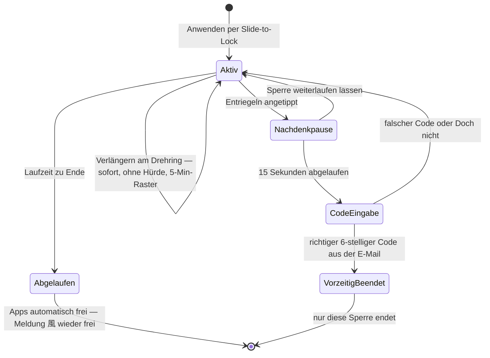
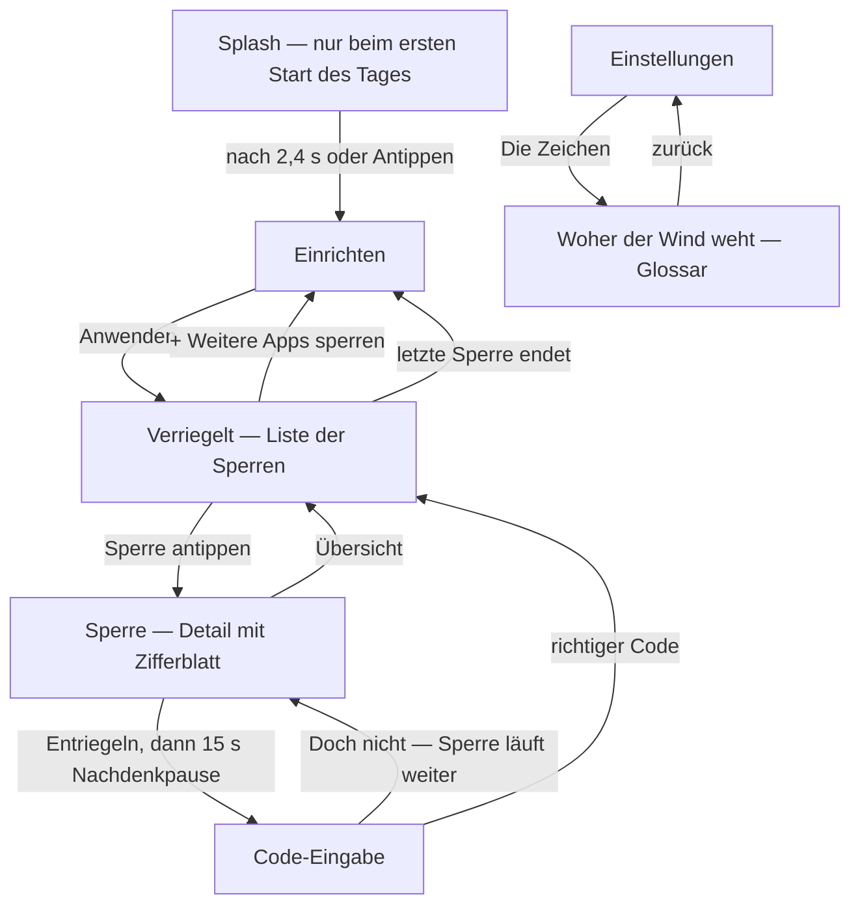
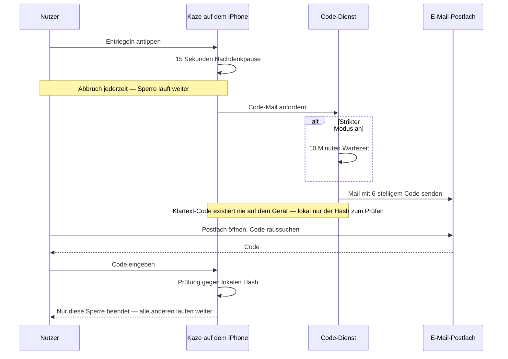

# Kaze 風 — Diagramme

Drei Diagramme als Ergänzung zur [fachlichen Spezifikation](spec.md). Alle in Mermaid — GitHub rendert sie direkt auf dieser Seite; sie sind Text, also versionierbar, per Diff reviewbar und ohne Grafik-Tool pflegbar.

---

## 1. Lebenszyklus einer Sperre (fachlich)

Das Herz der App: Wo sitzt die Hürde — und wo bewusst nicht.

**Invarianten** (gelten in jedem Zustand):

- Beliebig viele Sperren laufen parallel, jede mit eigener Uhr; eine App steckt immer nur in einer aktiven Sperre.
- Verlängern kennt keine Hürde, Verkürzen keine Abkürzung: Der Drehring dreht nur im Uhrzeigersinn, der einzige Weg zurück führt über den Notfallcode.
- Pro Sperre ein eigener Code in einer eigenen E-Mail; der Klartext existiert nie auf dem Gerät.
- Sperren überleben Neustart und Flugmodus (lokal terminiert, nicht server-abhängig).

---

## 2. Screen-Flow (fachlich)

**Hinweis für die Umsetzung:** Der Zugang zu den Einstellungen ist im Mockup über die Entwickler-Tab-Leiste gelöst; für die echte App ist er noch festzulegen (naheliegend: Zahnrad-Symbol oben auf dem Einrichten-Screen). → Offener Punkt.

---

## 3. Notfallcode — Sequenz (technisch)

Gezeigt ist **Variante B: Versand auf Anforderung** (Empfehlung, siehe Entscheidungsbox unten).

**Entscheidung nötig — das Diagramm hat eine Inkonsistenz in der Spezifikation sichtbar gemacht:**

| | Variante A: Versand bei Sperr-Erstellung | Variante B: Versand auf Anforderung (Empfehlung) |
|---|---|---|
| Ablauf | Code-Mail geht sofort beim Anwenden raus | Code-Mail geht erst raus, wenn Entriegeln gewünscht wird |
| Strikter Modus (10 Min) | Wirkungslos — die Mail liegt ja längst im Postfach | Wirkt wie gedacht: 10 Minuten zusätzliche Reibung ab Anforderung |
| Mockup-Text heute | „Der Code wurde um 9:41 gesendet" passt zu A | Text müsste werden: „Die Code-Mail ist unterwegs" |
| Reibung | Nur der Postfach-Umweg | Postfach-Umweg plus Wartezeit auf die Mail |

Der Mockup-Text auf der Code-Seite folgt derzeit Variante A, der Strikte Modus ergibt aber nur mit Variante B Sinn. Vorschlag: **B festlegen**, Mockup-Text und `spec.md` (Abschnitte 3.5 und 3.6) entsprechend anpassen.

**Zweite offene Architekturfrage — wer ist der „Code-Dienst"?**

- **Mini-Backend:** ein Endpoint erzeugt Code + Mail. Einfach zu bauen, aber ein Server, der läuft und gepflegt werden will — und die App wäre nicht mehr komplett autark.
- **Clientseitig:** die App erzeugt den Code lokal, speichert nur den Hash und verschickt die Mail (z. B. über einen reinen Mail-Versanddienst). Kein eigener Server-Zustand; der Klartext verlässt das Gerät genau einmal, in Richtung Postfach.

---

Zurück zur [Spezifikation](spec.md) · [README](../README.md)
